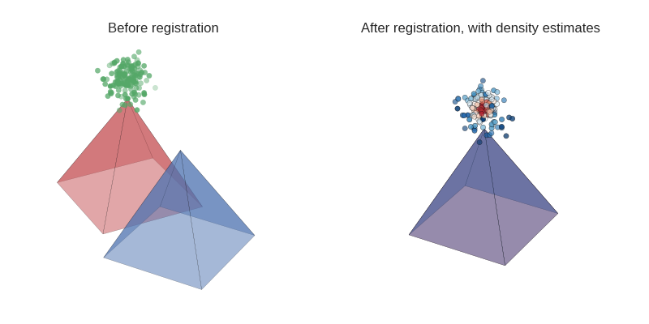

innear
======
Functions to register and analyse cell tracks based on [Pandas](http://pandas.pydata.org/) and [Vtk](http://www.vtk.org/) (thus Python2 only):



There is also a function that adds a `cell_id` column to the `DataFrame` by tracing the lineage, like this:
```
    id_center  id_mother  timestep Division  cell_id
0        1000          0         1    False        0
1        1001       1000         2    False        0
2        1002       1001         3    False        0
3        1003       1002         4    False        0
4        1004       1003         5    False        0
5        2000          0         1    False        1
6        2001       2000         2     True        1
7        2002       2001         3    False        2
8        2003       2001         3    False        3
9        2004       2002         4    False        2
10       2005       2003         4    False        3
11       2006       2004         5    False        2
12       3000        666        10    False        4
13       3001       3000        11    False        4
14       3002       3001        12    False        4
15       4000        666        10    False        5
16       4001       4000        11    False        5
17       4002       4001        12    False        5
18       4003       4002        13    False        5
19       4004       4003        14    False        5
```

For usage see the examples in `if __name__ == '__main__'`.
